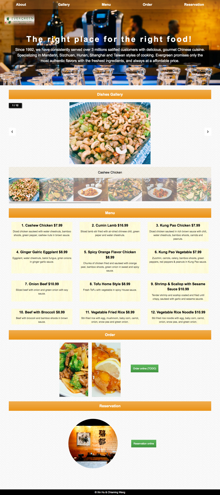
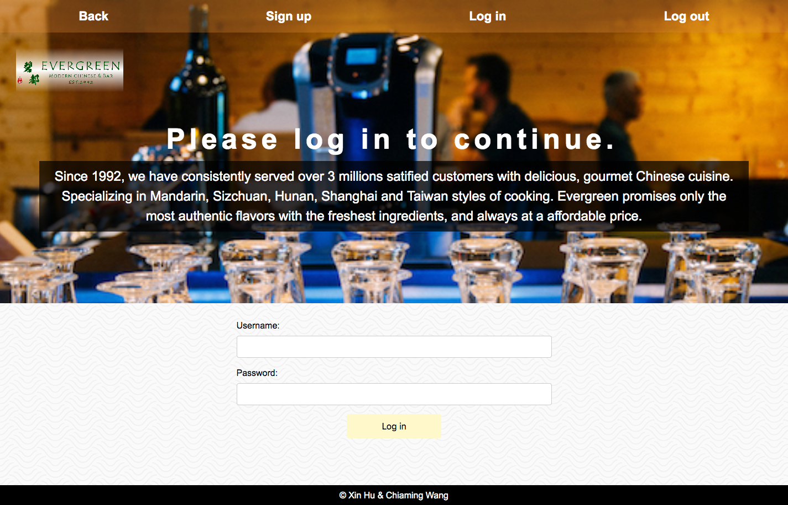
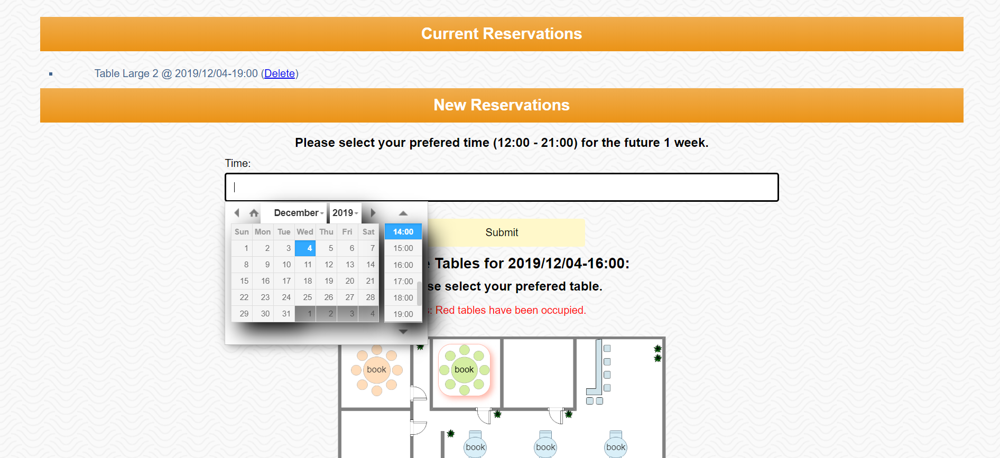
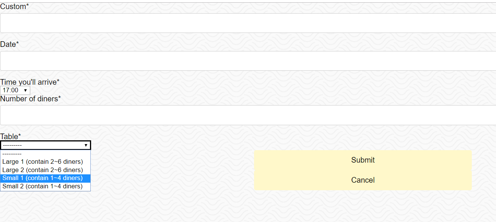

# Evergreen Restaurant Online System
This is the repo. of final project in SI664.
Our group includes two people - Xin Hu and Chiaming Wang.

demo website URL: http://664teamhw.pythonanywhere.com/

Evergreen is our favorite Chinese cuisine restaurant in north campus at Ann Arbor. Its website can order food and make reservation. After learning Django, we found it is possible for us to realize these functions. For making reservation, its website can fill in a form and the staff will contact custom later but when we fill in the form, we don’t know if there are available seats or not. So one thought came to us. We can combine the flight seat selection function with the reservation function. Custom can select which seat they want to sit at certain date and time. So order and reservation system is our focus. 
# Our Goals
Our goal is to develope an online order, reservation and delivery tracking 3-in-1 website based on django2.

Our structure will be:

```
Homepage
├── Menu
├── Order
|   ├── Shopping Cart
|   ├── Order-checking board (For kitchen)
|   └── Delivery tracking
└── Reservation
    ├── Reservation
    └── Current status of seats

```
## Home Page and Login Page
### Home page (responsive design)


1. responsive design, suitable for mobile, tablets and desktop.
2. clicking on the navigation bar, users can go to every section in this page including About, Gallery, Menu, Order and Reservation.
3. header part introduces the restaurant and the text has a typewriter effect. 
4. gallery shows 12 images of dishes and can switch by clicking on the thumbnails of images or the arrows beside the image.
5. menu shows dishes' names, prices and descriptions. 
6. green buttons in order section and reservation section can direct users to the corresponding pages(order page has not finished).
### Login page (responsive design)


1. responsive design, suitable for mobile, tablets and desktop.

2. clicking on the navigation bar, users can come back to the home page, sign up, log in and log out.

## Airplane-liked Reservation System
### Searching System ( GUI coming soon )


1. click block and choose book time  

2. press Submit  

3. available tables in that time will be shown below  

4. press table U want and redirect to Booking System  

### Booking System (after clicking table button above)


1. Booking System will get time and table automatically  

2. fill in the custom name and number of diners.  

