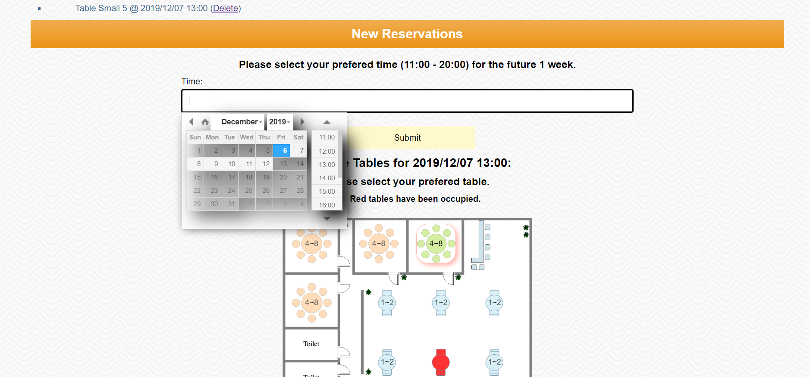
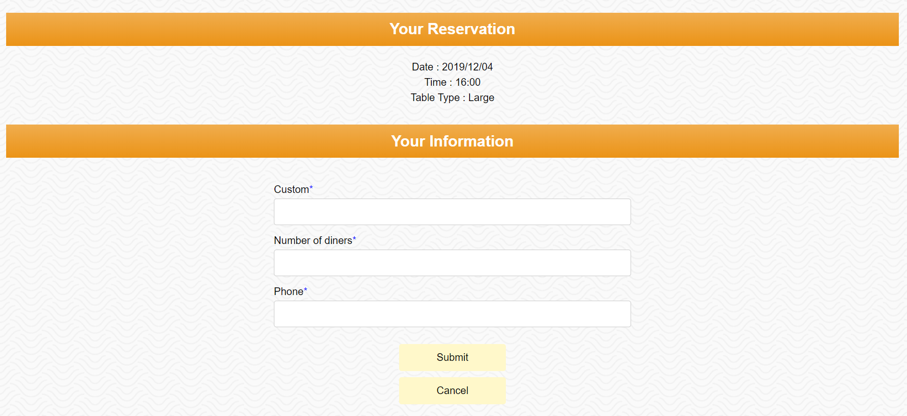

# 664_evergreenPOS
This is the repo. of final project in SI664.
Our group includes two people - Xin Hu and Chiaming Wang.

Evergreen is our favorite Chinese cuisine restaurant in north campus at Ann Arbor. Its website can order food and make reservation. After learning Django, we found it is possible for us to realize these functions. For making reservation, its website can fill in a form and the staff will contact custom later but when we fill in the form, we don’t know if there are available seats or not. So one thought came to us. We can combine the flight seat selection function with the reservation function. Custom can select which seat they want to sit at certain date and time. So order and reservation system is our focus. 
# Our Goals
Our goal is to develope an online order, reservation and delivery tracking 3-in-1 website based on django2.

Our structure will be:

```
Homepage
├── Menu(Done)
├── Order
|   ├── Shopping Cart
|   ├── Order-checking board (For kitchen)
|   └── Delivery tracking
└── Reservation(Done)
    ├── Reservation(Done)
    └── Current status of seats(Done)

```

##Airplane-liked Reservation System


